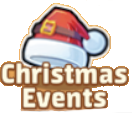
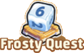
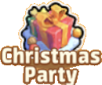
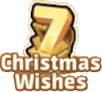
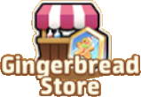
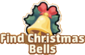
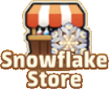
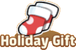

The Christmas event started on 23 Dec 2024 2am UTC and goes until 6 Jan 25 2am UTC.
It is composed by many subevents: Christmas Events, Frosty Quest, Christmas Party, Decorate the Christmas Tree, Find Santa Claus, Christmas Wishes, Gingerbread Store, Find Christmas Bells, Snowflake Store, and Holiday Gift.

#### Christmas Events

#####  How To Play

1. Complete Daily Quest for the Battle Pass to earn pass points.
2. The more pass points you collect, the more rewards you can unlock.
3. Activate the premium privileges to unlock advanced rewards.
4. Once all rewards have been claimed, a specific amount of additional pass points earned will grant you a bonus chest.

#### Frosty Quest

#####  How To Play

1. Roll the dice to get a number between 1-6. Your character will move that many squares and earn rewards based on the square they land on.
2. Item Squares: Stepping on an item square gives rewards and EXP. When the EXP is
maxed out, the square will upgrade, providing better rewards the next time you land on it. 3. Event Squares: Landing on an event square will trigger a random event, offering a surprise reward!
4. Start Square: Reaching or passing the start square triggers a grand prize, randomly awarding items from three item squares, and boosting their EXP points.
5.Random events that boost square EXP points will not apply if the square's EXP is already maxed out.
6. All dice rolls add up as points, which can be redeemed for rewards once a certain total is reached.
7. Event items that are not used before the event ends will be removed, please use them in time.

#### Christmas Party

#####  How It Works

1. Completing party tasks adds points to your guild. Points unlock the Christmas Party when they reach the required amount.
2. Tasks refresh daily.
3. Guild members ranked R4 or higher must schedule party times.
4. Once active, guild members can enter to collect Christmas gifts.
5. Parties last 10 minutes and give rewards every 1 minutes, for 8 rounds total.
6. Players can purchase extra party packs and schedule them personally.
7. Guilds can host 3 parties daily, and players can attend 3 Christmas Parties daily.
8. Unused party items will expire after the event ends, so don't miss them!

#### Decorate the Christmas Tree

Trade 10 {} to earn points towards rewards.

#####  How To Play

1. Lords with castle levels 7 or above can join the event.
2. Donate 10 "Christmas Bells" to earn 1
Christmas Tree Point. The tree levels up when the kingdom accumulates enough points, with a maximum of 5 levels (unlocking
progressively).
3. Each time the tree levels up, all players on the server can claim one reward. Rewards can only be claimed once per level.
4. Rankings for individuals and guilds are determined by donations, with rewards sent after the event ends.
5. Any unused "Christmas Bells" will convert into diamonds and be delivered via mail after the event.

#### Find Santa Claus

#####  How To Play

1. During the event, Santa Claus will appear randomly on the world map. Click Santa to claim a gift.
2. Each Santa can only be claimed once daily, with a daily reward limit that resets each day. 
3. Lords can use precise search to find a Santa Claus on the map who still has unclaimed reward for the day. The feature will enter a cooldown after use, requiring time before it can be used again.

#### Christmas Wishes

7-day login reward. There is a free and a premium set. Premium set can be bought for $9.99.

<table>
<thead>
<tr>
<th>Day</th>
<th>Free</th>
<th>Premium</th>
</tr>
</thead>
<tbody>
<tr>
<td>1</td>
<td>{}</td>
<td>{} {}</td>
</tr>
<tr>
<td>2</td>
<td>{}</td>
<td>{} {}</td>
</tr>
<tr>
<td>3</td>
<td>{}</td>
<td>{} {}</td>
</tr>
<tr>
<td>4</td>
<td>{}</td>
<td>{} {}</td>
</tr>
<tr>
<td>5</td>
<td>{}</td>
<td>{} {}</td>
</tr>
<tr>
<td>6</td>
<td>{}</td>
<td>{} {}</td>
</tr>
<tr>
<td>7</td>
<td>{}</td>
<td>{} {}</td>
</tr>
</tbody>
</table>

#### Gingerbread Store

{} currency can be used to buy different items.

#### Find Christmas Bells

#####  How To Play

1. During the event, you can get "Christmas Bells" by completing tasks, joining the battle pass event, finishing bounty quests, completing Merchant Carriage and Ruins Exploration.
2. Use "Christmas Bells" in the "Decorate the Christmas Tree".
3. At the end of the event, "Christmas Bells" will be converted to Diamonds and sent via mail.

#### Snowflake Store

{} currency can be used to buy different items.

#### Holiday Gift

#####  How To Play

1. During the event, buy packs to earn purchase points. Once purchase points reach the target, you can receive rewards. 
2. Collecting rewards will not consume purchase points, and Energy Crystals will be cleared after the event ends.